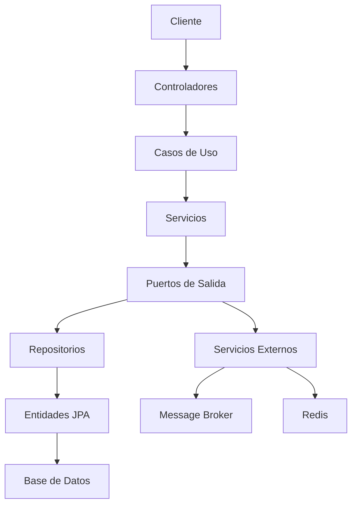
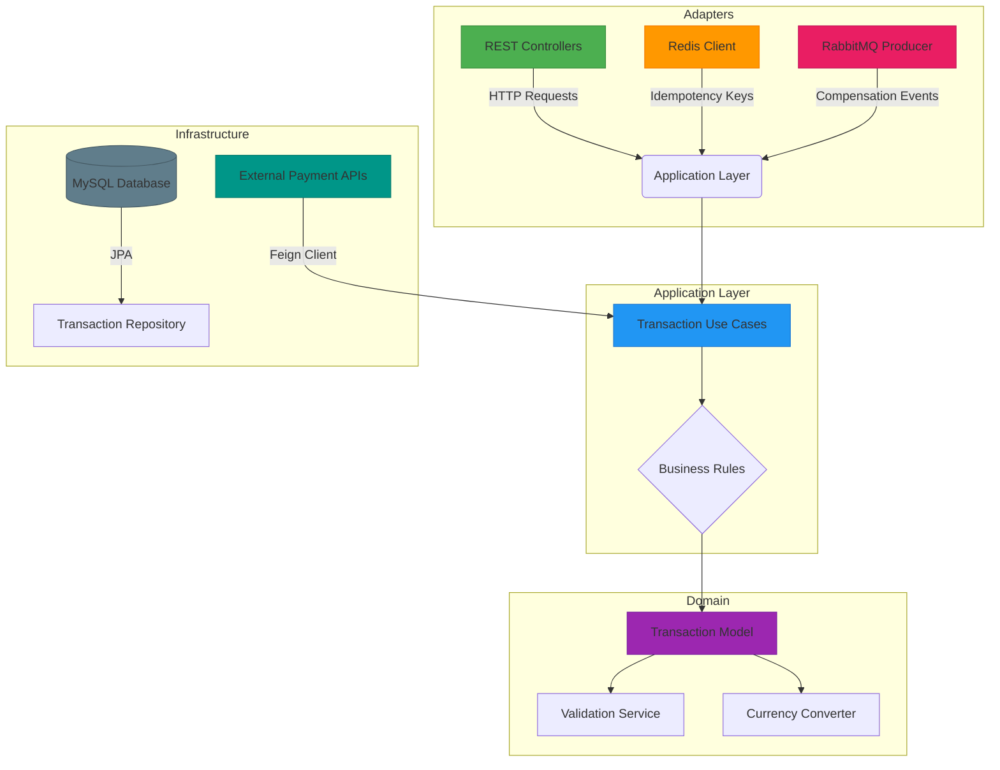

# Payment Transaction Manager

## Project Description
Payment Transaction Manager is a REST API developed in **Java 17** with **Spring Boot**, designed to manage financial transactions with support for multiple currencies, idempotency and clearing mechanisms. The solution is scalable, extensible and follows modern software design principles such as **Hexagonal Architecture**.

## Project Requirements
1. **Using Java 11 or 17**: Java 17 was chosen to take advantage of modern features such as sealed classes, improved switch expressions, and better performance.
2. **Use of Spring Boot**: Core framework to simplify configuration and provide a robust foundation for enterprise application development.
3. **Scalability and extensibility**: Implementation of a clear separation between components using **ports and adapters** to facilitate future extensions.
---

## Libraries and Tools Used

### **Spring Boot (Core)**
- **`spring-boot-starter-web`**: To build the REST API.
- **`spring-boot-starter-data-jpa`**: For data persistence using JPA and Hibernate.
- **`spring-boot-starter-security`**: To handle authentication and authorization.
- **`spring-boot-starter-validation`**: For input data validation.
- **`spring-boot-starter-actuator`**: For system monitoring and metrics.
- - **`spring-boot-starter-amqp`**: RabbitMQ integration **[NEW]**
- **`spring-boot-starter-data-redis`**: Redis integration **[NEW]**

**Rationale**: Provides a solid foundation for developing scalable REST services with easy library integration and robust community support.
AMQP for reliable event-driven compensation patterns and Redis for high-performance idempotency control.

---

### **Event Streaming & Caching**
- **RabbitMQ**: Message broker for compensation events
- **Redis**: Distributed caching for idempotency keys

**Justification**:
- RabbitMQ ensures reliable delivery of compensation events in failure scenarios
- Redis provides sub-millisecond response times for idempotency checks with TTL support

---

### **MapStruct**
- **`mapstruct` and `mapstruct-processor`**:

**Justification**: Automates the conversion between DTOs, domain models and JPA entities, reducing repetitive code and increasing maintainability.

---

### **JWT (Json Web Tokens)**
- **`jjwt-api`, `jjwt-impl`, `jjwt-jackson`**:

**Rationale**: Secure handling of token-based authentication to ensure endpoint protection. It offers a robust and easy-to-use implementation.

---

### **MySQL and Flyway**
- **`mysql-connector-j`**: Connector to integrate MySQL as a relational database.
- **`flyway-core` and `flyway-mysql`**: Migration and versioning of database schemas.

**Justification**: Flyway allows maintaining a versioned history of the schema, essential for systems with multiple environments.

---

### **SpringDoc OpenAPI**
- **`springdoc-openapi-starter-webmvc-ui`**:

**Justification**: Interactive REST API documentation with support for Swagger UI. It allows testing endpoints directly from the browser and improves the developer experience.

---

### **Testing**
- **`spring-boot-starter-test`**: Spring Boot test suite.
- **`spring-security-test`**: For security related tests.
- **`mockito-core`**: Mocking dependencies.
- **`junit-jupiter`**: Framework for unit testing.

**Rationale**: Ensures that the implemented functionalities are correct and allows test-driven development (TDD).

---

### **Jacoco**
- **`jacoco-maven-plugin`**:

**Justification**: Generates test coverage reports, ensuring that the implemented code is properly covered by tests and meets quality standards.

---

### **SonarQube**
- **`sonar-maven-plugin`**:

**Rationale**: Evaluates the quality of the source code by analyzing metrics such as technical debt, code coverage, duplicates and vulnerabilities.

---

## Project Architecture
**Hexagonal Architecture** is used with the following layers:

1. **Domain**: Contains the main business logic, domain models and related services.
2. **Application**: Defines the use cases and ports for interaction with other layers.
3. **Infrastructure**: Implements adapters for the database, external services and REST controllers.

**Advantages**:
- **Independence**: Reduces direct dependencies between business logic and frameworks.
- **Scalability**: Facilitates the incorporation of new types of transactions or changes in the database.



---

**Key Enhancements**:
1. **Event-Driven Compensation**: RabbitMQ listeners handle transaction rollbacks
2. **Distributed Idempotency**: Redis cluster-ready implementation
3. **CQRS Pattern**: Separates read/write operations for scaling

---

## Architecture Overview



**Leyenda:**
- 🟢 **Adapters**: Puntos de entrada/salida (HTTP, Mensajería, Cache)
- 🔵 **Application**: Casos de uso y orquestación
- 🟣 **Domain**: Lógica de negocio central
- 🟤 **Infrastructure**: Persistencia e integraciones externas
- 🟠 **Redis**: Gestión de idempotencia
- 🔴 **RabbitMQ**: Eventos de compensación

---

### **Run Dependencies**
```bash
# Redis (Idempotency)
docker run -d --name redis -p 6379:6379 redis

# RabbitMQ (Events)
docker run -d --name rabbitmq -p 5672:5672 -p 15672:15672 rabbitmq:management

---

### Installation
1.	Clone the repository:
```shell
    git clone https://github.com/CrisGadea/payment-transaction-manager.git
    cd payment-transaction-manager
```
2. Configure the database, redis and rabbitmq in application.yml:
```yaml
spring:
  data:
    redis:
      host: localhost
      port: 6379
      timeout: 5000
  rabbitmq:
    host: localhost
    port: 5672
    username: guest
    password: guest
  datasource:
    url: jdbc:mysql://localhost:3306/transaction_db
    username: your_username
    password: your_password
  jpa:
    hibernate:
      ddl-auto: validate
```
3. Compile and Run Application:
```shell
mvn clean install
mvn spring-boot:run
```
4. Running Tests:
```shell
mvn test
```
5. Generate Coverage Report:
```bash
mvn verify
mvn jacoco:report
```

---

## Next Steps

1. Set up a continuous integration (CI) environment with GitHub Actions or Jenkins.
2. Add Redis cluster configuration 
3. Implement DLQ (Dead Letter Queue) for failed events 
4. Add Prometheus metrics for Redis/RabbitMQ

---

## Contact
**Author**: Cristian Gadea

**Email**: [cristianhernangadea@gmail.com](mailto:cristianhernangadea@gmail.com)
